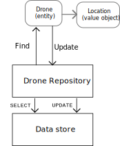
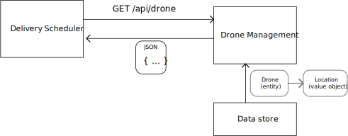

# API design for microservices

Good API design is important in a microservices architecture, because every service manages its own data, which means that data exchange happens either through messages or through API calls. APIs must be efficient, to avoid creating [chatty I/O](../antipatterns/chatty-io/index.md). Because services are designed by teams working independently, APIs must have well-defined semantics and versioning schemes, so that updates don't break other services.

It's important to distinguish between two types of API:

- A public API that client applications call. 
- Backend APIs that are used for interservice communication.

These two use cases have somewhat different requirements. The public API must be compatible with client applications, typically browser applications or native mobile applications. Most of the time, that means the public API will be REST over HTTP. For the backend APIs, however, you need to take network performance into account. Depending on the granularity of your services, interservice communication can result in a lot of network traffic. Services can quickly become I/O bound. For that reason, considerations such as serialization speed and payload size become more important.

## Technology choices

You have to consider several aspects of how an API is implemented:

- **REST or RPC interface**. For a RESTful interface, the most common choice is REST over HTTP using JSON. For an RPC-style interface, there are several popular frameworks, including gRPC, Appache Avro, and Apache Thrift.  

- **Interface definition language (IDL)**. An IDL is used to define the methods, parameters, and return values of an API. An IDL can be used to generate client code, serialiation code, API documentation, or to run automated API tests. Frameworks such as gRPC, Avro, and Thrift define their own IDL specifications. REST over HTTP does not have a standard IDL format, but a common choice is OpenAPI (formerly Swagger). You can also create an HTTP REST API without using a formal defininition language, but then you lose the benefits of code generation and automated testing.

- **Serialization format**. This defines how are objects are serialized over the wire. Options include JSON and XML, which are text-based, or binary formats such as protocol buffer. 

In some cases, you can mix and match options. For example, by default gRPC uses protocol buffers for serialization, but it can use other formats such as JSON.

## Considerations

Here are some things to think about when choosing how to implement an API.

- Consider the tradeoffs between using a REST-style interface versus an RPC-style interface.

    - REST models resources, which can be a natural way express your domain model. It defines a uniform interface based on HTTP verbs, which encourages evolvability. It has well-defined semantics in terms of idempotency, side effects, and response codes. And it enforces stateless communication, which improves scalability. 

    - RPC is more oriented around operations or commands. Because RPC interfaces look like local method calls, it may lead you to design overly chatty APIs. However, that doesn't mean RPC must be chatty. It just means you need to use care when designing the interface.

- Does the serialization format require a fixed schema? If so, do you need to compile a schema file?

- Consider framework and language support. HTTP is supported in nearly every framework and language. gRPC, Avro, and Thrift all have libraries for C++, C#, Java, and Python. Thrift and gRPC also support Go. 

- Look at the available tooling for generating client code, serializer code, and API documentation. For REST APIs, consider using OpenAPI (Swagger) to create API definitions. 

- Efficiency in terms of speed, memory, and payload size. Typically a gRPC-based interface is faster than REST over HTTP.
 
- If you are using a service mesh, what protocols are compatible with it? For example, linkerd has built-in support for HTTP, Thrift, and gRPC. 

- How will you version the APIs and data schemas? For recommendations on REST API versioning, see [Versioning a RESTful web API](../best-practices/api-design.md#versioning-a-restful-web-api).

- Do you need protocol translation? If you choose a protocol like gRPC, you may need a protocol translation layer between the public API and the back end. A [gateway](./gateway.md) can perform that function.

Our baseline recommendation is to choose REST over API unless you need the performance benefits of a binary protocol. REST over HTTP requires no special libraries. It creates minimal coupling, because callers don't need a client stub to communicate with the service. There is rich toolset around REST and HTTP, for schema definition, testing, and monitoring. Finally, HTTP is compatible with browser clients, so you don’t need a protocol translation layer between the client and the backend. 

However, if you choose REST over HTTP, you should do performance and load testing early in the development process, to validate whether it performs well enough for your scenario.

## API design considerations

There are many resources for designing RESTful APIs. Here are some that you might find helpful:

- [API design](../best-practices/api-design.md) 

- [API implementation](../best-practices/api-implementation.md) 

- [Microsoft REST API Guidelines](https://github.com/Microsoft/api-guidelines)

Here are some specific considerations to keep in mind.

- Different types of client, such as mobile application and desktop web browser, may requires different payload sizes or interaction patterns. Consider using the [Backends for Frontends pattern](../patterns/backends-for-frontends.md) to create separate backends for each client, that expose an optimal interface for that client.

- For operations with side effects, consider making them idempotent and implementing them as PUT methods. That will enable safe retries and can improve resiliency. The chapters [Ingestion and workflow](./ingestion-workflow.md#idempotent-vs-non-idempotent-operations) and [Interservice communication](./interservice-communication.md) discuss this issue in more detail.

- HTTP methods can have asynchronous semantics, where the method returns a response immediately, but the service carries out the operation asynchronously. The method should return an HTTP 202 response code in that case.

## Mapping REST to DDD patterrns

Patterns such as entity, aggregate, and value object are designed to place certain constraints on the objects in your domain model. For example, value objects are immutable. In many discussions of DDD, the patterns are modeled using OO language concepts like constructors or property getters and setters. 

For example, here is a TypeScript implementation of a value object. The properties are declared to be read-only, so the only way to modify a Location is to create a new one. The properties are validated when the object is created.

```ts
export class Location {
    readonly latitude: number;
    readonly longitude: number;

    constructor(latitude: number, longitude: number) {
        if (latitude < -90 || latitude > 90) {
            throw new RangeError('latitude must be between -90 and 90');
        }
        if (longitude < -180 || longitude > 180) {
            throw new RangeError('longitude must be between -180 and 180');
        }
        this.latitude = latitude;
        this.longitude = longitude;
    }
}
```

Coding practices like this are particularly important in a more monolithic application. In a large code base, many subsystems might use the `Location` object, so it's important for the object to enforce correct behavior. 

Another example is the Repository, which ensures that other parts of the code cannot make arbitrary writes to the data store:



But in a microservices architecture, services don't share a code base and don't share data stores. Instead, they communicate through APIs. Consider the case where the Delivery Scheduler service requests information about a drone from the Drone Management service. The Drone Management service will have an internal model of a drone, which is represented in code. But the Delivery Scheduler doesn't see that. Instead, it receives a wire representation of the entity &mdash; for example, JSON in an HTTP response body.



As a result, code has a smaller surface area. If the Drone Management service defines a Location class, the scope of that class is limited to the service, making its easier to validate the correct usage. If another service needs to update the drone location, it has to go through the Drone Management service API.

In this guidance, we focus less on OO coding principles, and put more emphasis on API design. But it turns out that RESTful APIs can model many of the tactical DDD concepts.

- RESTful APIs model *resources*, which map naturally to aggregates. Aggegates are consistency boundaries. Operations on aggregates should never leave an aggregate in an inconsistent states.  Instead of creating APIs allow a client to manipulate the internal state of an aggregate, favor coarse-grained APIs that expose aggregates as resources.

- Aggregates are addressable by ID. Aggregates correspond to resources, and the URL is the stable identifier.

- Child entities can be reached at a unique URL. Following HATEOS principles, this can be conveyed through links in the representation of the parent entity.

- Value objects are updated by replacing the entire value through a PUT or PATCH request.

- A collection resource can act like a repository.

| DDD concept | REST equivalent | Example | 
|-------------|-----------------|---------|
| Aggregate ID | URL | `/deliveries/{id}` |
| Child entities | URL and links | `/deliveries/{id}/packages/{packageId}` |
| Update value objects | PUT or PATCH | `PUT /deliveries/{id}/dropoff` |
| Repository | Collection | `/deliveries?status=pending` |

